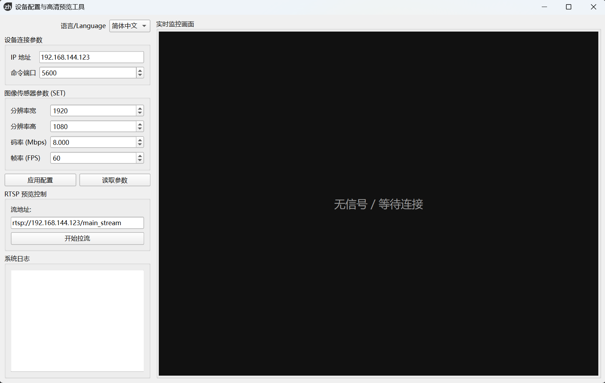

# udp_cfg_gui



一个基于 **PySide6 (Qt for Python)** 的 Windows 上位机工具，集成了 **UDP 设备配置** 与 **RTSP 高清实时预览** 功能。

该工具专门配合设备端的 `udp_cfgd` 守护进程使用，既能修改视频流参数（width/height/bitrate/fps），又能立即查看到修改后的画面效果，实现“所见即所得”的调试体验。

---

## 1. 项目背景

在嵌入式视频系统（如 SSC338Q IPC / AI Camera）中，视频流参数通常由配置文件决定，并且只能在程序启动时读取。

设备端通过 `udp_cfgd` 提供了一个 **轻量级 UDP ASCII 协议**，用于在运行时修改配置文件并重启 RTSP 程序。

本项目提供一个 **Windows 图形化上位机**，用于方便地通过 UDP 修改这些参数，并直接在右侧窗口验证视频流画质，无需手工编辑配置文件或使用第三方播放器轮询。

---

## 2. 功能特性

- ✅ **Windows GUI**：基于 PySide6 开发，现代化的左右分栏布局。
- ✅ **UDP 配置通信**：无连接、低依赖，支持 GET/SET 指令。
- ✅ **RTSP 实时预览**：
  - 内置基于 OpenCV/FFmpeg 的低延迟播放器。
  - **强制 TCP 传输**：有效防止无线网络环境下的花屏和丢包。
  - **断流重连**：支持信号丢失后的自动重连机制。
- ✅ **画质渲染增强**：
  - 内置色彩空间校正，自动解决安防摄像头画面“发灰”问题。
  - 智能亮度提升，增强画面通透感。
- ✅ **参数管理**：一次性配置四个关键参数（分辨率宽/高、码率、帧率）。
- ✅ **状态反馈**：实时显示设备返回的 `OK / ERR` 响应及系统日志。

---

## 3. 协议说明（设备端）

设备端需运行 `udp_cfgd`，并监听 UDP 端口（默认 `5600`）。

---

## 4. 版本更新说明
**v1.1.0 - 2025-12-18**
```text
本次更新主要引入了视频流预览及画质优化功能：

1. 新增 RTSP 播放器
在界面右侧增加了实时监视窗口，配置参数后可立即点击“开始拉流”验证效果。

底层采用 cv2.CAP_FFMPEG 后端，并强制开启 rtsp_transport;tcp 选项，大幅提升画面稳定性，消除马赛克现象。

2. 画面渲染优化
针对原始 YUV 信号在 PC 显示器上色彩范围（16-235）不匹配导致画面发灰的问题，加入了亮度与对比度自动校正。

调整策略：

去除锐化：保持画面自然，避免边缘出现白边或噪点。

提亮暗部：优化 Gamma 曲线（alpha=1, beta=-25），提升画面通透度，还原真实观感。

3. 交互体验改进
界面重构为双栏布局（左侧配置区，右侧视频区）。

视频窗口支持自适应缩放（KeepAspectRatio），始终保持正确比例。
```
**v1.1.1 - 2025-12-19**
```text
修复已知bug